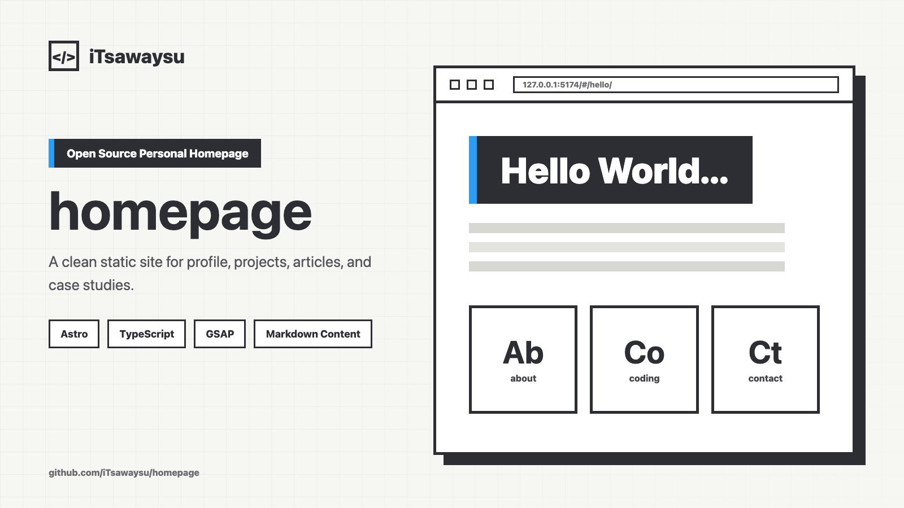

# homepage

<p align="center">
  
</p>

一个开源的个人主页项目，用来展示我的个人介绍、项目、文章和案例内容；项目基于 Astro 静态构建。

## 在线预览

可以直接打开线上预览查看当前页面效果：[https://homepage-three-wheat.vercel.app/](https://homepage-three-wheat.vercel.app/)

## 功能

- 个人介绍、项目展示、文章列表和案例详情。
- 静态构建输出，部署简单。
- Markdown 维护文章内容。
- JSON 维护案例内容。
- Hash route 导航，适合紧凑的单页主页体验。

## 技术栈

- Astro
- TypeScript
- GSAP
- Playwright

## 快速开始

```bash
npm install
npm run dev
```

打开：

```text
http://127.0.0.1:5174
```

## 内容维护

- 文章：`src/content/articles/*.md`
- 案例：`src/content/case-studies/*.json`
- 图片：`public/assets/homepage/`

新增、修改、排序或移走内容时，直接改上面的内容文件即可。文章和案例路由来自内容文件里的 `url` 字段。

修改案例本地路由时，需要在 `src/scripts/routing/routes.ts` 的 `CASE_STUDY_LEGACY_ALIASES_BY_CURRENT_SLUG` 保留明确的 legacy alias 决策，用于兼容旧书签里的案例 slug。

`public/assets/homepage/js/main.js` 和 `src/templates/site-shell.html` 是保留的参考文件，不是当前运行时核心依赖。内容改动中不要删除或移动它们。

## 常用命令

| 命令 | 说明 |
| --- | --- |
| `npm run dev` | 启动本地 Astro 开发服务器。 |
| `npm run build` | 类型检查并构建静态站点到 `dist/`。 |
| `npm run preview` | 本地预览构建后的站点。 |

## 部署

```bash
npm run build
```

将生成的 `dist/` 目录部署到静态托管服务即可。

## 许可证

MIT。详见 [LICENSE](./LICENSE)。
